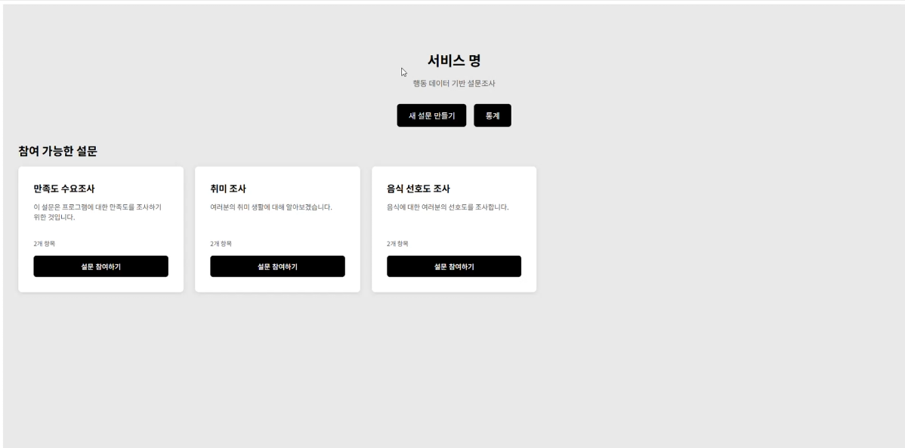
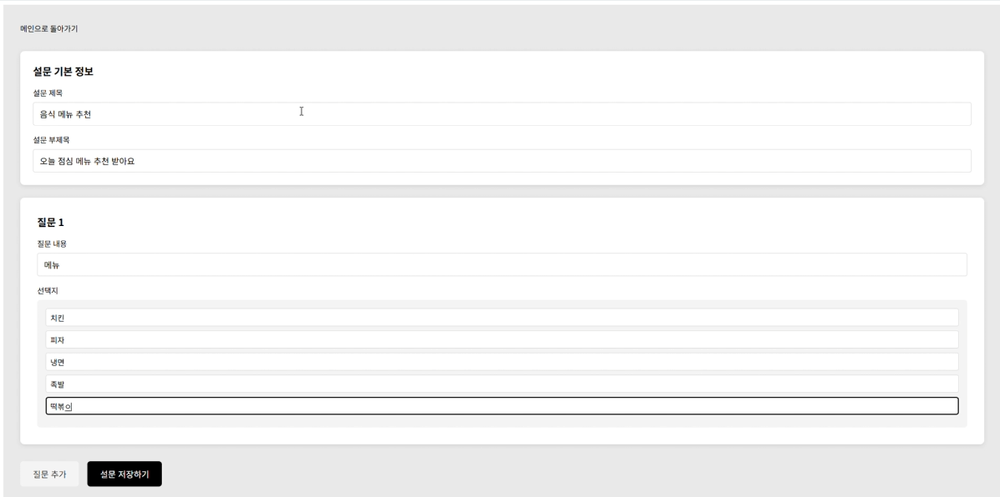
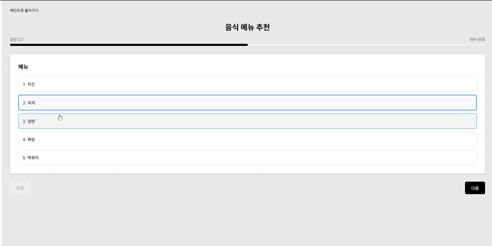
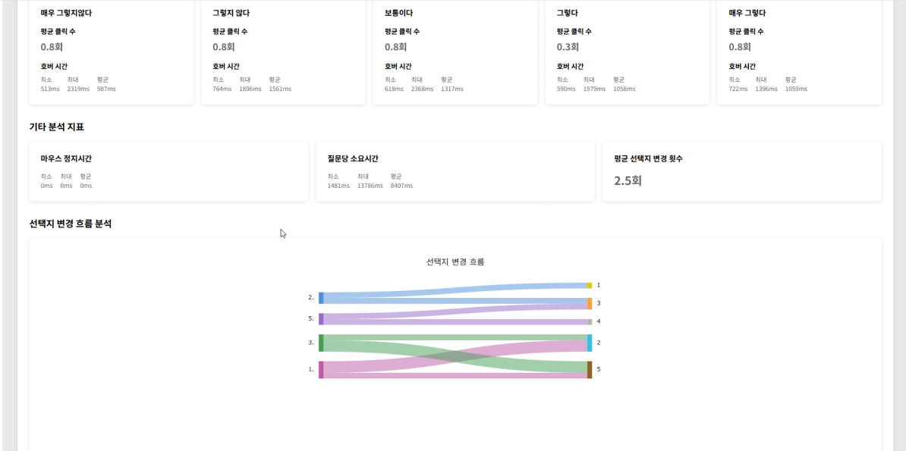
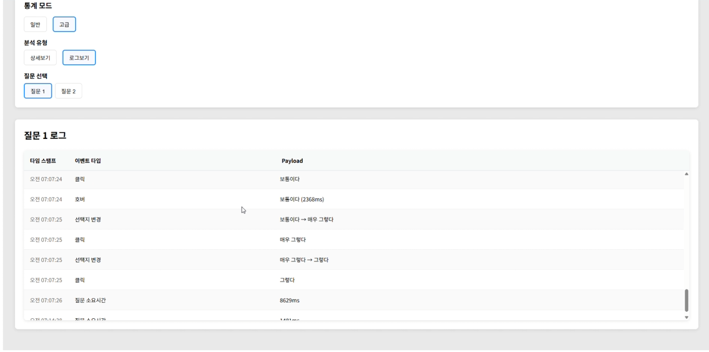

# 선택장애 (선장) – 실시간 설문조사 행동 분석 플랫폼

> Backend Repository: https://github.com/kroad0129/deepdive-survey-be

선택장애(선장)는 사용자가 설문조사를 생성하고 참여할 수 있는 실시간 플랫폼입니다.  
행동 데이터 추적과 AI 기반 분석을 통해 설문 참여자의 행동 패턴을 분석하고,  
통계 시각화를 통해 인사이트를 제공합니다.

---

## 🚀 주요 기능

### 설문 생성 및 관리

- 설문 제목, 부제목, 질문 및 선택지 설정
- 설문 생성 완료 페이지 및 관리 기능

### 설문 참여

- 설문 ID 기반 설문 참여
- 설문 완료 페이지 및 응답 제출

### 행동 데이터 추적

- 마우스 호버, 클릭, 선택 변경 이벤트 추적
- 정지 시간, 체류 시간 측정
- 사용자 행동 패턴 분석

### 통계 및 분석

- 설문별 응답 통계 시각화
- 상세 통계 분석 페이지
- AG Charts를 활용한 차트 시각화

### 디버깅 및 모니터링

- 이벤트 로그 디버깅 페이지
- 사용자 행동 데이터 실시간 모니터링

---

## 주요 기능 스크린샷

<p align="center">
  
  
  
  
  
</p>

---

## ⚙ 기술 스택

| 분류       | 기술                        |
| ---------- | --------------------------- |
| Language   | TypeScript                  |
| Framework  | React 19.1.0                |
| Build Tool | Vite 7.0.4                  |
| Routing    | React Router DOM 7.7.1      |
| Charts     | AG Charts Enterprise 12.1.1 |
| State      | React Hooks                 |
| Styling    | CSS Modules                 |
| Linting    | ESLint 9.30.1               |

---

## 🧾 데이터 구조 요약

| 인터페이스       | 설명                              |
| ---------------- | --------------------------------- |
| `Survey`         | 설문 기본 정보 (ID, 제목, 부제목) |
| `Question`       | 설문 질문 (순서, 텍스트, 선택지)  |
| `Choice`         | 질문 선택지 (순서, 텍스트)        |
| `SurveyResponse` | 설문 응답 데이터                  |
| `FrontendSurvey` | 프론트엔드 호환 설문 타입         |

※ 상세 필드는 types/survey.ts 파일 참고

---

## 📁 디렉토리 구조

```
src/
├── components/      # 재사용 가능한 컴포넌트
│   ├── QuestionForm.tsx    # 질문 폼 컴포넌트
│   └── SurveyCard.tsx      # 설문 카드 컴포넌트
├── pages/          # 페이지 컴포넌트
│   ├── HomePage.tsx        # 메인 홈페이지
│   ├── CreatePage.tsx      # 설문 생성 페이지
│   ├── SurveyPage.tsx      # 설문 참여 페이지
│   ├── StatisticsPage.tsx  # 통계 페이지
│   └── DebugEventLogPage.tsx # 디버그 페이지
├── hooks/          # 커스텀 훅
│   └── useBehaviorTracking.ts # 행동 추적 훅
├── services/       # API 서비스 및 로깅
│   ├── api.ts              # API 통신
│   ├── behaviorLogger.ts   # 행동 로깅
│   └── baseUrl.ts          # 기본 URL 설정
├── types/          # TypeScript 타입 정의
│   ├── survey.ts           # 설문 관련 타입
│   └── behavior.ts         # 행동 데이터 타입
├── styles/         # 공통 스타일
│   └── common.ts           # 공통 스타일 정의
└── assets/         # 정적 자산
    └── check.png           # 체크 아이콘
```

---

## 📌 주요 페이지 및 기능

| 페이지      | 경로               | 기능                         |
| ----------- | ------------------ | ---------------------------- |
| 홈페이지    | `/`                | 설문 생성 및 참여 시작       |
| 설문 생성   | `/create`          | 설문 제목, 질문, 선택지 설정 |
| 설문 참여   | `/survey/:id`      | 설문 ID 기반 설문 참여       |
| 통계 보기   | `/statistics`      | 설문별 응답 통계             |
| 상세 통계   | `/statistics/:id`  | 특정 설문 상세 분석          |
| 디버그 로그 | `/debug-event-log` | 행동 데이터 이벤트 로그      |

---

## 👥 팀 정보

**구름 딥다이브 4팀 - 선택장애(선장)**

- 백엔드: 유성연, 양재혁혁
- 프론트: 김태희

---

## 📌 배운 점 & 느낀 점

- React 19와 TypeScript를 활용한 현대적인 프론트엔드 개발
- 사용자 행동 데이터 추적을 통한 UX 분석 경험
- AG Charts를 활용한 데이터 시각화 구현
- 컴포넌트 기반 아키텍처와 커스텀 훅을 통한 코드 재사용성 향상
- Vite를 활용한 빠른 개발 환경 구축

---
